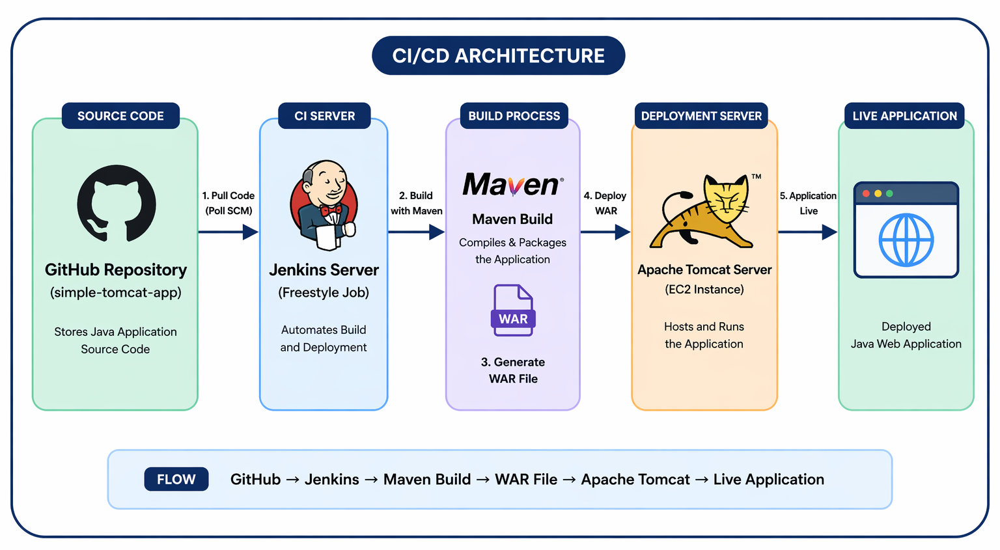

# 🚀 Automated Java Application Deployment Using Jenkins (CI/CD)

## 📌 Project Overview

This project demonstrates a complete **CI/CD process** for deploying a Java web application using **Jenkins, Maven, and Apache Tomcat** on AWS EC2.

The process automates the entire workflow — from pulling code to deploying it live — without manual intervention.

---

## 📂 Project Structure

```
jenkins-ci-cd-java-deployment/
│── screenshots/
│── project-docs/
│   └── Automated Java Application Deployment Using Jenkins.pdf
│── README.md
```

---

## 🏗️ Architecture Diagram
```
* **Jenkins Server** → Build & Automation  
* **Tomcat Server** → Deployment Target  
* **GitHub** → Source Code Repository  



---

## 🔗 Source Code Repository

👉 https://github.com/dhirajmali17/simple-tomcat-app

---

## ⚙️ Tech Stack

* Jenkins (Freestyle Job)
* Apache Tomcat 9
* AWS EC2 (Ubuntu)
* Git & GitHub
* Maven
* SSH (for remote deployment)

---

## 🔄 CI/CD Workflow

1. Jenkins pulls latest code from GitHub
2. Maven builds the project
3. WAR file is generated
4. Jenkins deploys WAR to Tomcat server
5. Application goes live automatically

---

## 📸 Project Screenshots

### 1️⃣ GitHub Source Code


---

### 2️⃣ Jenkins Job Creation


---

### 3️⃣ Git Configuration in Jenkins


---

### 4️⃣ Poll SCM Trigger Setup


---

### 5️⃣ Tomcat Credentials Configuration


---

### 6️⃣ WAR Deployment Configuration


---

### 7️⃣ Jenkins Build Success


---

### 8️⃣ Jenkins Console Output


---

### 9️⃣ Tomcat Manager (Application Running)


---

### 🔟 Final Application Output


---

## 📄 Documentation

📘 Detailed step-by-step documentation is available here:  
👉 [View Full Documentation](./project-docs/Automated%20Java%20Application%20Deployment%20Using%20Jenkins.pdf)

---

## 🎯 Key Features

* Automated build and deployment using Jenkins (CI/CD)
* Maven-based build system
* Remote deployment to Tomcat
* SCM polling for automation
* Clean project documentation
* Real-time application deployment

---

## 🚀 Future Enhancements

* Convert Freestyle job → Jenkins Pipeline (Jenkinsfile)
* Dockerize application
* Kubernetes deployment
* Add monitoring (Prometheus + Grafana)

---

## 👨‍💻 Author

**Dhiraj Mali**
DevOps & Cloud Enthusiast
